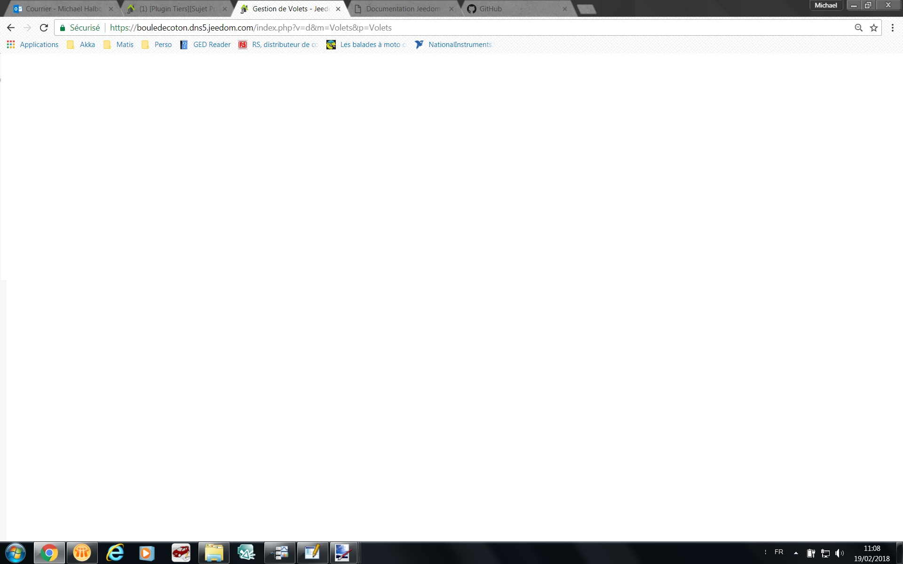

Description
===
Ce plugin a pour objectif de gérer facilement et automatiquement vos volets.
Celui-ci est basé sur le plugin Héliotrope qui est un prérequis pour son utilisation.

> Avant l'utilisation de se plugin bien vérifier le fonctionnement du plugin Heliotrope.

> Pour le bon fonctionnement du plugin, tous les gestions pour un volet doivent etre activé sur la meme zone.
Il est recommandée, mais pas obligatoire, d'utiliser une zone par volet afin de faciliter la configuration et la gestion

* le plugin gérera automatiquement l'ouverture et la fermeture de vos volets au lever du soleil et à la tombée de la nuit,
* le plugin gérera automatiquement l'ouverture et la fermeture de vos volets en fonction de la position du soleil,
    * en mode été, il fermera les volets lorsque le soleil sera dans la fenêtre afin de préserver une température idéale dans la maison,
    * en mode hiver, il ouvrira les volets pour permettre au soleil de chauffer la pièce et faire des économies d'énergie,
* le plugin gérera automatiquement l'ouverture et la fermeture de vos volets en fonction de votre présence.
* le plugin gérera automatiquement l'ouverture et la fermeture de vos volets en fonction de la météo.

Commandes et widgets
===
Pour chaque équipement, le plugin va créer des commandes.

* `Activer` / `Désactiver` => `Etat activation` : Permet de gere l'armement du plugin par une voie externe (scénario, plugins, ...)
* `Etat du volet`: Etat determinant si le volet doit etre ouvert ou fermer
* `Position du volet`: Mise a jour de l'état
* `Position du soleil` : Détermine si le soleil est dans la fenêtre ou non
* `Ratio Horizontal` : Estimation par le plugin du ratio d'ouverture Horizontal
* `Ratio Vertical` : Estimation par le plugin du ratio d'ouverture Vertical
* `Mode` : Determine dans quel Mode (Saison) fonctionne le plugin 
* `Etat mode` : Représentation du mode actif
* `Gestion Active` : Indicateur de gestion en cours d'utilisation

Gestion Active
---
Cette commande permet de déterminer quelle gestion est en cours actuellement.

* `Manuel` : Le plugin est en mode manuel et n'intervient plus
* `Jour` : il fait jour, on active toutes les autres gestions. On vérife les autres gestions avant d'exécuter les actions.
* `Nuit` : il fait nuit, toutes les autres gestions sont désactivées.
* `Abscent` : il n'y a personne à la maison, on ferme les volets. La gestion de présence interdit toutes autres actions hormis la `Nuit`.
* `Meteo` : si toutes les conditions météo sont vérifiées, on ferme les volets. La gestion météo interdit toutes autres gestions hormis la gestion `Nuit`.
* `Azimut` : si le soleil est dans la fenêtre, on ferme les volets. La gestion par azimuth autorise toutes autres gestions. 

La position du volet et son état
---

Une commande nous permet de mettre à jour manuellement l'état de la position du volet vue par le plugin.
Cette commande nous permet de faire gérer certaines options par scénarios.
L'état est également visible depuis le widget afin de faciliter la compréhension du plugin.

Le mode et son état
---

Ces 2 commandes vont permettre de basculer le plugin en mode "été" ou "hiver".
C'est à vous de déterminer à quel moment il faut gérer ce changement.

L'icône ci-dessus montre le mode "été", le volet est fermé lorsque le soleil est dans la fenêtre.
Le volet se fermera pour garder la fraicheur.

L'icône ci-dessus montre le mode "hiver", le volet est ouvert lorsque le soleil est dans la fenêtre.
Le volet s'ouvrira pour accumuler la chaleur

la position du soleil
---
Cette commande nous informe si le soleil est dans la fenêtre ou pas.

Dans la fenêtre.

Hors fenêtre.

Paramétrage
===
Comme pour tous les plugins, nous allons commencer par créer un groupe de zone avec le bouton `Ajouter`.
Après avoir nommé ce groupe, nous allons pouvoir commencer à mettre en place nos zones.

Configuration générale Jeedom
---

### Parametre Géneral

* `Nom` : le nom a déjà été paramétré mais vous avez la possibilité de le changer
* `Objet parent` : ce paramètre permet d'ajouter l'équipement dans un objet Jeedom
* `Catégorie` : déclare l'équipement dans une catégorie
* `Activer` : permet d'activer l'équipement
* `Visible` : permet de rendre l'équipement visible dans le Dashboard
* `Héliotrope` : choisir l'équipement Héliotrope à prendre en compte pour ce groupe de zone

### Choix des gestions actives

* `Manuel` : activation de la gestion manuel, autorise les changement manuel de volet
* `Jour` : activation de la gestion en jour 
* `Nuit` : activation de la gestion en nuit
* `Azimut` : activation de la gestion en fonction de la position du soleil (dépend de l'équipement Héliotrope)
* `Absent` : activation de la gestion en fonction de la présence
* `Météo` : active la gestion météo. 

### Gestion de l'etat reel

* `Objet etat réel` : Commande Jeedom permetant de définir l'état réel du volet
* `Hauteur de fermeture` : Seuil de la hauteur de l'état réel séparant l'ouverture de la fermeture

Gestion du lever et coucher du soleil
---
Cette gestion permet d'ouvrir ou de fermer le volets en fonction du lever et du coucher du soleil.
Il faut activer la gestion pour faire apparaitre les champs de configuration spécifique.

### Général

* `Ouverture et fermeture aléatoire` : Si vous avez plusieurs volet sur la zone et que vous souhaitez un ouverture aléatoire (Attention il est impératif que les action de mouvement soit renseigné dans les action)
* `Délai maximal du mode aléatoire (s)` : Délais maximal qui sera appliqué entre chaque exécution de mouvement aléatoire

### Gestion du jour

* `Heure d'ouverture minimum` : Permet d'imposer au plugin un heure minimum a partir de laquel le plugin ne tiendra plus compte de l'heure du lever du soleil 
* `Type de lever du soleil` : permet de choisir quel type d'horaire vous voulez pour le lever du jour
* `Délai au lever du jour (min)` : délai avant (-) ou après (+) l'heure du lever du jour

### Gestion de la nuit

* `Heure de fermeture maximum` :  Permet d'imposer au plugin un heure maximum a partir de laquel le plugin ne tiendra plus compte de l'heure du coucher du soleil 
* `Type de coucher du soleil` : permet de choisir quel type d'horaire vous voulez pour la tombée de la nuit
* `Délai à la tombée de la nuit (min)` : délai avant (-) ou après (+) l'heure de la tombée de la nuit

Il est important que ses 2 gestions fonctionnent ensemble.
Si la gestion de Jour n'est pas activé le plugin restera en gestion de Nuit.

Pour compléter cette gestion, il est possible d'ajouter des conditions.
Par exemple, dans les chambres, je ne veux pas que les volets s'ouvrent avant 8h.
J'ajouterai donc une condition de ce type

Gestion de Manuel
---

La gestion manuel est détécté si votre été réel du volet change et qui n'est pas autorisé par le plugin.
Elle vas vous permetre de pouvoir autoriser des changement manuel en desarmant le plugin.

Se sera donc a vous de gerer le réarmement pour retrouver un fonctionnement automatique de vos volets

Gestion de présence
---

La gestion de présence permet de fermer les volets lorsque nous ne sommes pas là.
Il faut activer la gestion pour faire apparaitre les champs de configuration spécifique.

* Gestion de la présence : objet Jeedom indiquant s'il y a quelqu'un dans la maison.

Lorsque la gestion de presence détecte une absence, toutes les autres gestions hormis la gestion de la nuit sont inactives.

Gestion Météo
---
La gestion météo vérifie toutes les minutes les conditions enregistrées.
Si toutes les conditions que vous avez complétées sont valides, alors l'ordre de fermeture sera donné et toutes les autres gestions hormis la gestion de la nuit sont inactives.

Gestion par Azimut
---

Ce mode de fonctionement permet de fermer les volets lorsque le soleil est entre les angles d'exposition au soleil de la fenêtre.

### Définition de l'angle d'exposition au soleil 

Cette étape est importante pour le fonctionnement de la gestion en fonction de la position du soleil.

Sur votre fenêtre doit apparaitre 3 curseurs. 
Ces 3 curseurs vont donc former notre angle.
Le point central doit être obligatoirement placé au dessus de notre fenêtre. 
Les 2 autres vont former l'angle et peuvent être placés n'importe où à l'extérieur de la maison. 
Attention toutefois à bien respecter la droite et la gauche de votre fenêtre vue de l'extérieur (indiqué sur les points de la carte).

### Conditionner

Pour compléter cette gestion, il est possible d'ajouter des conditions.
Par exemple, je veux que les volets ne se ferment que si j'ai une température ambiante en été supérieure à 23.
J'ajouterai donc une condition de ce type.

Conditions d'exécution et de réarmeent
---

Afin d'affiner tous les cas d'utilisation de gestion de nos volets, nous pouvons ajouter des conditions.

Paramètres complémentaires :
* `Sur Action` : Permet d'identifier les conditions à tester pour executer une action   
* `Sur Réactivation` :  Permet d'identifier les conditions à tester pour rearmer le plugin automatiquement
* `Inverser l'action` : Permet de relancer une évaluation des conditions avec un position inverse du volet  
* `Condition` : Saisir votre contions. L'ensemble de condion forme un ET logique
* `Type de gestion` : sélectionner toutes les gestions où la condition doit être vérifiée (avec la touche `Ctrl`)
* `Mode` : sélectionner tous les modes où la condition doit être vérifiée (avec la touche `Ctrl`)
* `Action` : sélectionner toutes les actions où la condition doit être vérifiée (avec la touche `Ctrl`)

Pour vous aider à la configuration des conditions, un éditeur est ajouté.

Pour que chaque condition soit validée et les actions éxécutées, ces paramètres doivent être validés.

Actions d'ouverture et de fermeture
---

Tout a droit, il est posible d'activer ou non la commande.
Choisissez les actions à mener sans oublier de configurer leurs valeurs.

Paramètres complémentaires:

* `Activation` : Permet d'activer ou non l'action
* `Mouvement` : Permet de déterminer si l'action est une action de mouvement et donnera un retour d'état.
* `Type de gestion` : sélectionner toutes les gestions où l'action doit être exécutée (avec la touche `Ctrl`).
* `Action` : Saisir / choisir votre commande. Il est possible de saisir des opération arithmétique dans les options.
* `Mode` : sélectionner tous les modes où l'action doit être exécutée (avec la touche `Ctrl`).
* `Action` : Sélectionner toutes les actions où l'action doit être exécutée (avec la touche `Ctrl`).

### Utilisation des commandes Ratio

Avec la gestion azimut, le plugin calcul et met a jours des commandes ratiométriques (Horizontal et Vertical) afin que le rayonnement du soleil soit masqué.
Si vous souhaitez utiliser les commandes ratiométriques, il est juste necessaire de séléctioner la commande ratio en valeur de votre commande proportionnel de votre volet.

FAQ
===

**Le plugin reste en gestion Nuit**
> Verifier que la gestion de jours est activé

**Le plugin reste en mode manuel**
> Pour sortir du mode manuel il faut réarmer **Manuellement ou par scénario** le plugin.

**Je ne veux pas que mes volets s'ouvre le matin avant 10h**
> Pour cela il faut ajouter une condition sur la gestion jour

**Mes Volets ne se bouge plus**
> Verifier que la gestion manuel ne soit pas active

**Le cadenas est ouvert, mais le plugin contiue a analysé les inforamtion d'héliotrope**
> Le plugin est désarmé, mais le plugin continue de mettre à jours ses paramètres 

**Je suis passée en mode manuel dans la journée, comment réarmer automatiquement le plugin**
> Pour le réarmement automatique il est nécessaire d'ajouter une condition de réarmement sur la gestion et le mouvement profuit.
Par exemple pour le réarmement en gestion de nuit, je vais ajouter une condition du style #time# ++ 2000 en gestion de nuit et sur la fermeture

**J'ai configuré ma gestion Azimut avec le ratio mais il fait tros de mouvement**
> Il est possible de limiter les mouvements avec une formule dans les options.

**Le plugin ne fonctionne pas avec mon module Fibaro**
> Les modules fibaro son gradué proportionnelement de 0 a 99%.
Pour palier a ce probleme il est recommandé d'utiliser le plugin avec sont ratioVertical (ou ratioHorizontal) en configurant le min (0) et max (99) pour la commande ratio appliquer.
Egalement la Hauteur de seuil (ouvert/ fermer) doit etre comprise entre 1 et 98%
