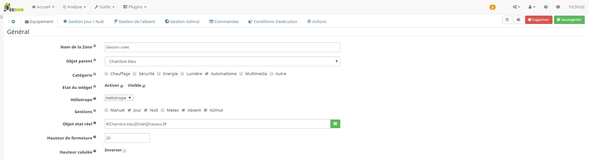
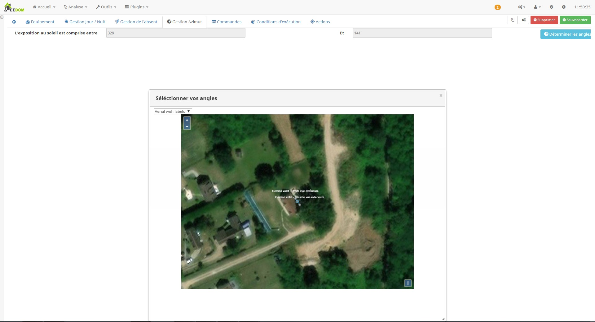
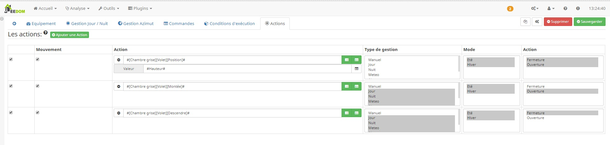

Description
===
Ce plugin a pour objet de gérer facilement et automatiquement vos volets.
Celui-ci est entièrement basé sur le plugin Héliotrope qui est un prérequis pour son utilisation.

Une fois configuré :
===
* le plugin gérera automatiquement l'ouverture et la fermeture de vos volets au lever du soleil et à la tombée de la nuit,
* le plugin gérera automatiquement l'ouverture et la fermeture de vos volets en fonction de la position du soleil,
 * en mode été, il fermera les volets lorsque le soleil sera dans la fenêtre afin de préserver une température idéale dans la maison,
 * en mode hiver, il ouvrira les volets pour permettre au soleil de chauffer la pièce et faire des économies d'énergie,
* le plugin gérera automatiquement l'ouverture et la fermeture de vos volets en fonction de votre présence.

Commandes et widgets
===
Pour chaque équipement, le plugin va créer des commandes.

Gestion Active
---
Cette commande permet de déterminer quelle gestion est en cours actuellement.

- `Day` : il fait jour, on active toutes les autres gestions. On vérife les autres gestions avant d'exécuter les actions.
- `Night` : il fait nuit, toutes les autres gestions sont désactivées.
- `Present` : il n'y a personne à la maison, on ferme les volets. La gestion de présence interdit toutes autres actions hormis la nuit.
- `Meteo` : si toutes les conditions météo sont vérifiées, on ferme les volets. La gestion météo interdit toutes autres gestions hormis la gestion `Night`.
- `Azimuth` : si le soleil est dans lé fenêtre, on ferme les volets. La gestion par azimuth autorise toutes autres gestions.	

La position du volet et son état
---

Une commande nous permet de mettre à jour manuellement l'état de la position du volet vue par le plugin.
Cette commande nous permet de faire gérer certaines options par scénarios.
L'état est également visible depuis le widget afin de faciliter la compréhension du plugin.

Le mode et son état
---

Ces 2 commandes vont permettre de basculer le plugin en mode "été" ou "hiver".
C'est à vous de déterminer à quel moment il faut gérer ce changement.

L'icône ci-dessus montre le mode "été", le volet est fermé lorsque le soleil est dans la fenêtre.

L'icône ci-dessus montre le mode "hiver", le volet est ouvert lorsque le soleil est dans la fenêtre.

la position du soleil
---
Cette commande nous informe si le soleil est dans la fenêtre ou pas.
 

Dans la fenêtre.

Hors fenêtre.

Paramétrage
===
Comme pour tous les plugins, nous allons commencer par créer un groupe de zone avec le bouton `Ajouter`.
Après avoir nommé ce groupe, nous allons pouvoir commencer à mettre en place nos zones.

Configuration générale Jeedom
---

* `Nom` : le nom a déjà été paramétré mais vous avez la possibilité de le changer
* `Objet parent` : ce paramètre permet d'ajouter l'équipement dans un objet Jeedom
* `Catégorie` : déclare l'équipement dans une catégorie
* `Activer` : permet d'activer l'équipement
* `Visible` : permet de rendre l'équipement visible dans le Dashboard
* `Héliotrope` : choisir l'équipement Héliotrope à prendre en compte pour ce groupe de zone

* `Manuel` : activation de la gestion manuel, autorise les changement manuel de volet
* `Jour` : activation de la gestion en jour 
* `Nuit` : activation de la gestion en nuit
* `Azimut` : activation de la gestion en fonction de la position du soleil (dépend de l'équipement Héliotrope)
* `Absent` : activation de la gestion en fonction de la présence
* `Météo` : active la gestion météo. 

* `Objet etat réel` : Commande Jeedom permetant de définir l'etat réel du volet
* `Hauteur de fermeture` : Seuil de la hauteur de l'etat reel séparant l'ouverture de la fermeture

Gestion du lever et coucher du soleil
---
Cette gestion permet d'ouvrir ou de fermer le volets en fonction du lever et du coucher du soleil.
Il faut activer la gestion pour faire apparaitre les champs de configuration spécifique.

* `Heure d'ouverture minimum` : Permet d'imposer au plugin un heure minimum a partir de laquel le plugin ne tiendra plus compte de l'heure du lever du soleil 
* `Type de lever du soleil` : permet de choisir quel type d'horaire vous voulez pour le lever du jour
* `Délai au lever du jour (min)` : délai avant (-) ou après (+) l'heure du lever du jour

* `Heure de fermeture maximum` :  Permet d'imposer au plugin un heure maximum a partir de laquel le plugin ne tiendra plus compte de l'heure du coucher du soleil 
* `Type de coucher du soleil` : permet de choisir quel type d'horaire vous voulez pour la tombée de la nuit
* `Délai à la tombée de la nuit (min)` : délai avant (-) ou après (+) l'heure de la tombée de la nuit

Il est important que ses 2 gestions fonctionne ensemble.
Si la gestion de Jour n'est pas activé le plugin restera en gestion de Nuit.

Pour compléter cette gestion, il est possible d'ajouter des conditions.
Par exemple, dans les chambres, je ne veux pas que les volets s'ouvrent avant 8h.
J'ajouterai donc une condition de ce type

Gestion de Manuel
---

La gestion manuel est détécté si votre été réel du volet change et qui n'est pas autorisé par le plugin.
Elle vas vous permetre de pouvoir autorisé des changement manuel est bloquant les actions des autres gestions
Lorsque l'etat réel sera cohérant avec l'etat du plugin, la gestion automatique sera reactivé

Gestion de présence
---

La gestion de présence permet de fermer les volets lorsque nous ne sommes pas là.
Il faut activer la gestion pour faire apparaitre les champs de configuration spécifique.

* Gestion de la présence : objet Jeedom indiquant s'il y a quelqu'un dans la maison.

Lorsque la gestion de presence détecte une absence, toutes les autres gestions hormis la gestion de la nuit sont inactives.

Gestion Météo
---
La gestion météo verifie toutes les minutes les conditions enregistrées.
Si toutes les conditions que vous avez complétées sont valides, alors l'ordre de fermeture sera donné et toutes les autres gestions hormis la gestion de la nuit sont inactives.

Gestion par Azimut
---

Ce mode de fonctionement permet de fermer les volets lorsque le soleil est entre les angles d'exposition au soleil de la fenêtre.
Pour compléter cette gestion, il est possible d'ajouter des conditions.
Par exemple, je veux que les volets ne se ferment que si j'ai une température ambiante en été supérieure à 23.
J'ajouterai donc une condition de ce type.

Définition de l'angle d'exposition au soleil 
---

Nous allons maintenant déterminer l'angle d'exposition au soleil.
Cette étape est importante pour le fonctionnement de la gestion en fonction de la position du soleil.

Sur votre fenêtre doit apparaitre 3 curseurs. 
Ces 3 curseurs vont donc former notre angle.
Le point central doit être obligatoirement placé au dessus de notre fenêtre. 
Les 2 autres vont former l'angle et peuvent être placés n'importe où à l'extérieur de la maison. 
Attention toutefois à bien respecter la droite et la gauche de votre fenêtre vue de l'extérieur (indiqué sur les points de la carte).

Conditions d'exécution
---
Afin d'affiner tous les cas d'utilisation de gestion de nos volets, nous pouvons ajouter des conditions.

Pour vous aider à la configuration des conditions, un éditeur est ajouté.

Paramètres complémentaires :

* `Inverser l'état si faux` : permet de relancer une évaluation des conditions avec un position inverse du volet
* `Type de gestion` : sélectionner toutes les gestions où la condition doit être vérifiée (avec la touche `Ctrl`)
* `Mode` : sélectionner tous les modes où la condition doit être vérifiée (avec la touche `Ctrl`)
* `Action` : sélectionner toutes les actions où la condition doit être vérifiée (avec la touche `Ctrl`)

Pour que chaque condition soit validée et les actions éxécutées, ces paramètres doivent être validés.

Actions d'ouverture et de fermeture
---

Choisissez les actions à mener sans oublier de configurer leurs valeurs.

Paramètres complémentaires:

* `Type de gestion` : sélectionner toutes les gestions où l'action doit être exécutée (avec la touche `Ctrl`)
* `Mode` : sélectionner tous les modes où l'action doit être exécutée (avec la touche `Ctrl`)
* `Action` : Sélectionner toutes les actions où l'action doit être exécutée (avec la touche `Ctrl`)

Pour la gestion azimut en été, le plugin calcul la hauteur du volet pour que le rayonnement du soleil soit masqué.
Pour utiliser la commande hauteur dans une action du plugin, il suffit de mettre en valeur le tag #Hauteur#

